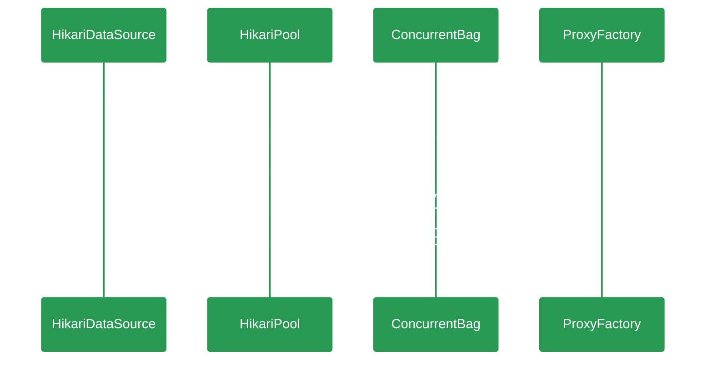

# {{ page.title }}

> Fast, simple, reliable. HikariCP is a "zero-overhead" production ready JDBC connection pool. At roughly 130Kb, the library is very light. 
> 一个简单、轻量（130kb）、稳定、高性能的JDBC数据库链接池，SpringBoot2.0开始作为Spring应用的默认数据库链接池。      

---
本文以开发者视角从代码层面分析及学习HikariCp的设计思路及技术应用，深入了解一下"光"背后的秘密。   




## HikariDataSource
``` java
public class HikariDataSource extends HikariConfig implements DataSource, Closeable {
  private final AtomicBoolean isShutdown = new AtomicBoolean();
  private final HikariPool fastPathPool;
  private volatile HikariPool pool;

  public HikariDataSource() {
      super();
      fastPathPool = null;
   }

   public HikariDataSource(HikariConfig configuration) {
      configuration.validate();
      configuration.copyStateTo(this);
      pool = fastPathPool = new HikariPool(this);
      this.seal();
   }

   @Override
   public Connection getConnection() throws SQLException {
      if (isClosed()) {
         throw new SQLException("HikariDataSource " + this + " has been closed.");
      }
      if (fastPathPool != null) {
         return fastPathPool.getConnection();
      }
      HikariPool result = pool;
      if (result == null) {
         synchronized (this) {
            result = pool;
            if (result == null) {
               validate();
               try {
                  pool = result = new HikariPool(this);
                  this.seal();
               } catch (PoolInitializationException pie) {
                  if (pie.getCause() instanceof SQLException) {
                     throw (SQLException) pie.getCause();
                  } else {
                     throw pie;
                  }
               }
            }
         }
      }
      return result.getConnection();
   }
}
```

## HikariPool

## ConcurrentBag

## ProxyFactory

## 参考文档
+ [github/HikariCp](https://github.com/brettwooldridge/HikariCP)