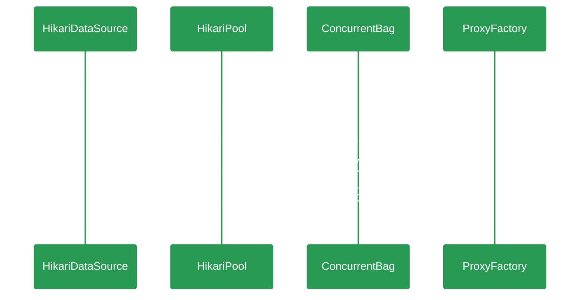
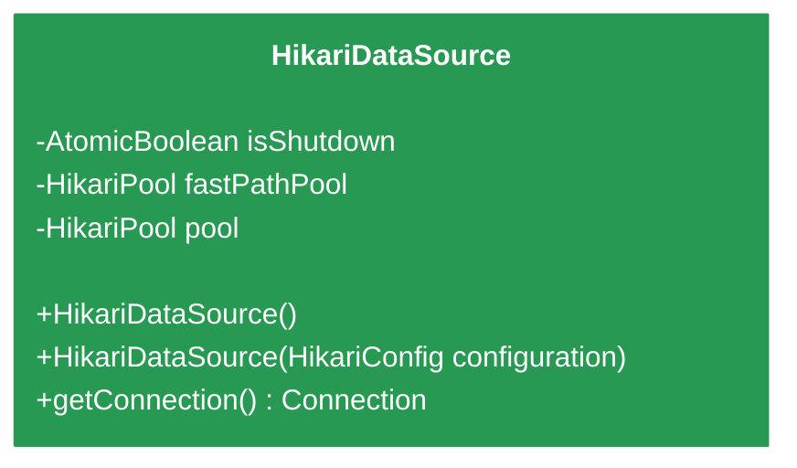

# {{ page.title }}

> Fast, simple, reliable. HikariCP is a "zero-overhead" production ready JDBC connection pool. At roughly 130Kb, the library is very light. 
> 一个简单、轻量（130kb）、稳定、高性能的JDBC数据库链接池，SpringBoot2.0开始作为Spring应用的默认数据库链接池。      

---
本文以开发者视角从代码层面分析及学习HikariCp的设计思路及技术应用，深入了解一下"光"背后的秘密。   

## HikariDataSource

## HikariPool

## ConcurrentBag

## ProxyFactory

## 参考文档
+ [github/HikariCp](https://github.com/brettwooldridge/HikariCP)