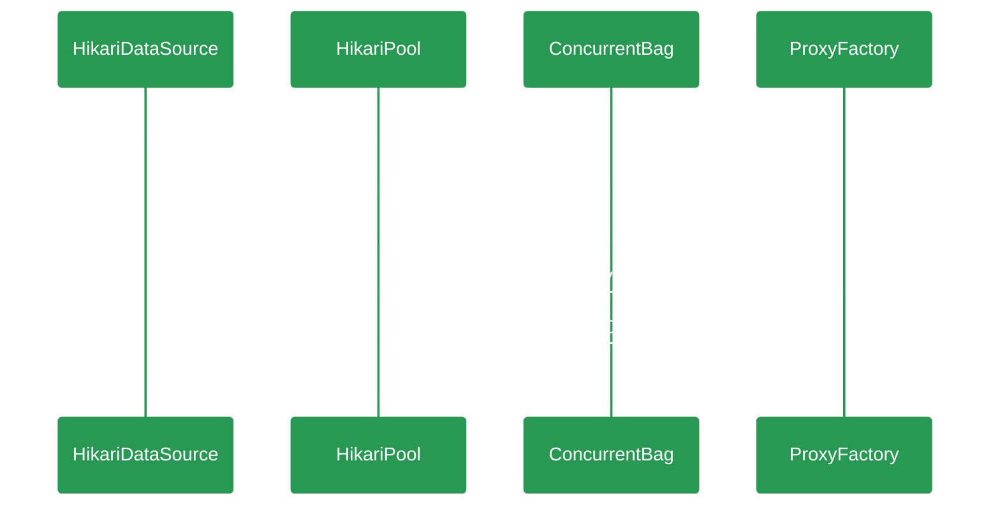

# {{ page.title }}

> Fast, simple, reliable. HikariCP is a "zero-overhead" production ready JDBC connection pool. At roughly 130Kb, the library is very light. 
> 一个简单、轻量（130kb）、稳定、高性能的JDBC数据库链接池，SpringBoot2.0开始作为Spring应用的默认数据库链接池。      

---
本文以开发者视角从代码层面分析及学习HikariCp的设计思路及技术应用，深入了解一下"光"背后的秘密。   




## HikariDataSource
``` java
public class HikariDataSource extends HikariConfig implements DataSource, Closeable {
  private final AtomicBoolean isShutdown = new AtomicBoolean(); // dataSource的状态，是否已关闭
  private final HikariPool fastPathPool; // final修饰的 HikariPool
  private volatile HikariPool pool; // volatile修饰的HikariPool 由于可见性及重排序的问题，相较于fastPathPool性能会低一些
  // 如果设置了dataSource参数lazy为true的情况，不会马上构建链接池，在getConnection的时候才会去初始化
  public HikariDataSource() {
      super();
      fastPathPool = null;
   }
   // 非lazy加载的情况下使用HikariConfig的配置创建数据源，并设置fastPathPool
   public HikariDataSource(HikariConfig configuration) {
      configuration.validate(); // 验证hikari的配置参数并设置默认值
      configuration.copyStateTo(this); // 使用入参配置项对当前类HikariConfig进行赋值
      pool = fastPathPool = new HikariPool(this); // 根据HikariConfig构建HikariPool
      this.seal(); // 封存 不再允许修改配置属性
   }
   @Override
   public Connection getConnection() throws SQLException {
      if (isClosed()) { // 判断数据源状态
         throw new SQLException("HikariDataSource " + this + " has been closed.");
      }
      // 优先使用fastPathPool获取Connection
      if (fastPathPool != null) { return fastPathPool.getConnection();} 
      // 无参构造当前DataSource时候，涉及到并发获取链接，所以此处使用双重检查来初始化链接池管理器并返回链接
      HikariPool result = pool;
      if (result == null) { synchronized (this) {
            result = pool;
            if (result == null) {
               validate();
               try { 
                  pool = result = new HikariPool(this);
                  this.seal();
               } catch (PoolInitializationException pie) {
               }
            }
         }
      }
      return result.getConnection();
   }
}
```

## HikariPool
Hikari链接池管理器，用于对链接池进行监控，对链接池进行伸缩、关闭等处理
``` java
public final class HikariPool extends PoolBase implements HikariPoolMXBean, IBagStateListener {
   // 构造方法
   public HikariPool(final HikariConfig config) {
      // 构建poolBase
      super(config);
      // 创建并发包，hikariCp核心功能
      this.connectionBag = new ConcurrentBag<>(this);
      // 基于java并发工具类Semaphore实现的锁，用于控制链接池的挂起及恢复（仅在设置了isAllowPoolSuspension参数为true时生效）
      this.suspendResumeLock = config.isAllowPoolSuspension() ? new SuspendResumeLock() : SuspendResumeLock.FAUX_LOCK;
      // 初始化调度任务线程池HouseKeeping
      this.houseKeepingExecutorService = initializeHouseKeepingExecutorService();
      // checkFailFast检查与数据库连通性，如果有问题直接快速失败。
      checkFailFast();
      // 设置监控
      if (config.getMetricsTrackerFactory() != null) {
         setMetricsTrackerFactory(config.getMetricsTrackerFactory());
      } else {
         setMetricRegistry(config.getMetricRegistry());
      }
      // 设置健康检查
      setHealthCheckRegistry(config.getHealthCheckRegistry());
      // 处理config及pool的Mbean注册，用于JMX的监控、管理
      handleMBeans(this, true);
      // 添加链接的阻塞队列
      ThreadFactory threadFactory = config.getThreadFactory();
      final int maxPoolSize = config.getMaximumPoolSize();
      LinkedBlockingQueue<Runnable> addConnectionQueue = new LinkedBlockingQueue<>(maxPoolSize);
      // 创建添加/关闭链接的线程池
      this.addConnectionExecutor = createThreadPoolExecutor(addConnectionQueue, poolName + " connection adder", threadFactory, new CustomDiscardPolicy());
      this.closeConnectionExecutor = createThreadPoolExecutor(maxPoolSize, poolName + " connection closer", threadFactory, new ThreadPoolExecutor.CallerRunsPolicy());
      // 创建处理泄漏任务的工厂
      this.leakTaskFactory = new ProxyLeakTaskFactory(config.getLeakDetectionThreshold(), houseKeepingExecutorService);
      // 创建延迟执行的调度任务，每30秒（默认）执行一次，处理链接池的空闲链接
      this.houseKeeperTask = houseKeepingExecutorService.scheduleWithFixedDelay(new HouseKeeper(), 100L, housekeepingPeriodMs, MILLISECONDS);
   }
}
```
### method: getConnection(connectionTimeout) 获取链接
```java
// hardTimeout 超时时间（取配置时间，默认为30秒）
public Connection getConnection(final long hardTimeout) throws SQLException {
   // 信号量锁，允许链接池挂起时才使用，正常情况空执行，多次空执行的情况下，JIT会优化为不再执行，优化性能。
   suspendResumeLock.acquire();
   final long startTime = currentTime();
   try {
      long timeout = hardTimeout;
      do {
         // 从并发包中借出一个PoolEntry（Connection的包装类）,connectionBag类细讲
         PoolEntry poolEntry = connectionBag.borrow(timeout, MILLISECONDS);
         if (poolEntry == null) {
            break; // We timed out... break and throw exception
         }
         final long now = currentTime();
         // 如果当前链接是被标记为驱逐的 或者 当前entry的空窗期大于500ms（默认500ms）并且当前链接是非存活状态
         if (poolEntry.isMarkedEvicted() || (elapsedMillis(poolEntry.lastAccessed, now) > aliveBypassWindowMs && !isConnectionAlive(poolEntry.connection))) {
            // 关闭当前链接
            closeConnection(poolEntry, poolEntry.isMarkedEvicted() ? EVICTED_CONNECTION_MESSAGE : DEAD_CONNECTION_MESSAGE);
            // 计算剩余超时时间， 大于0的话继续循环获取链接直到超时未取出则抛出超时异常
            timeout = hardTimeout - elapsedMillis(startTime);
         } else {
            // 记录借出状态
            metricsTracker.recordBorrowStats(poolEntry, startTime);
            // 通过代理工厂获取代理链接（使用Javassist字节码技术） 后面详细讲
            return poolEntry.createProxyConnection(leakTaskFactory.schedule(poolEntry), now);
         }
      } while (timeout > 0L);
      // 超过connectionTimeout时间未拿到链接，监控记录借出的超时记录并抛出超时异常
      metricsTracker.recordBorrowTimeoutStats(startTime);
      throw createTimeoutException(startTime);
   } catch (InterruptedException e) {
      // 中断当前线程
      Thread.currentThread().interrupt();
      throw new SQLException(poolName + " - Interrupted during connection acquisition", e);
   } finally {
      // 释放锁
      suspendResumeLock.release();
   }
}
```
## ConcurrentBag
```java
public class ConcurrentBag<T extends IConcurrentBagEntry> implements AutoCloseabl {    
   // 构造器 final修饰的listener用于回调链接池管理器添加connection的方法
   public ConcurrentBag(final IBagStateListener listener) {
         this.listener = listener;
         // 是否使用弱引起的ThreadLocal
         this.weakThreadLocals = useWeakThreadLocals();
         // 公平的同步队列，不存储数据，一对一进行数据传递
         this.handoffQueue = new SynchronousQueue<>(true);
         // 阻塞的请求数
         this.waiters = new AtomicInteger();
         // 共享的链接集合，采用CopyOnWriteArrayList实现读的安全无锁操作。
         this.sharedList = new CopyOnWriteArrayList<>();
         if (weakThreadLocals) {
            this.threadList = ThreadLocal.withInitial(() -> new ArrayList<>(16));
         } else {
            // 用于线程缓存的集合，优先从ThreadLocal中获取可用链接，从而减少不同线程之间的竞争
            this.threadList = ThreadLocal.withInitial(() -> new FastList<>(IConcurrentBagEntry.class, 16));
         }
   }
}
// 包装Connection的实体
final class PoolEntry implements IConcurrentBagEntry {
   // 原子性的更新PoolEntry的状态
   static {
      stateUpdater = AtomicIntegerFieldUpdater.newUpdater(PoolEntry.class, "state");
   }
   // 构造器
   PoolEntry(final Connection connection, final PoolBase pool, final boolean isReadOnly, final boolean isAutoCommit) {
      // 链接
      this.connection = connection;
      // 链接池管理器，用于回调管理器的方法
      this.hikariPool = (HikariPool) pool;
      this.isReadOnly = isReadOnly;
      this.isAutoCommit = isAutoCommit;
      this.lastAccessed = currentTime();
      // Statement的FastList容器
      this.openStatements = new FastList<>(Statement.class, 16);
   }
}
```
综上所示，HikariPool的核心功能（监控除外）大概布局见下图：

## ProxyFactory
```java
public final class ProxyFactory {
   // 所有的方法体均有JavassistProxyFactory字节码代理工厂生成
   static ProxyConnection getProxyConnection(final PoolEntry poolEntry, final Connection connection, final FastList<Statement> openStatements, final ProxyLeakTask leakTask, final boolean isReadOnly, final boolean isAutoCommit) {
      // Body is replaced (injected) by JavassistProxyFactory
      throw new IllegalStateException("You need to run the CLI build and you need target/classes in your classpath to run.");
   }
   static Statement getProxyStatement(final ProxyConnection connection, final Statement statement) {}
   static CallableStatement getProxyCallableStatement(final ProxyConnection connection, final CallableStatement statement) {}
   static PreparedStatement getProxyPreparedStatement(final ProxyConnection connection, final PreparedStatement statement) {}
   static ResultSet getProxyResultSet(final ProxyConnection connection, final ProxyStatement statement, final ResultSet resultSet) {}
   static DatabaseMetaData getProxyDatabaseMetaData(final ProxyConnection connection, final DatabaseMetaData metaData) {}
}

// 通过字节码生成之后的完整类 下面Hikari的Connection、Statement均由JavassistProxyFactory生成，然后委托给JDBC去执行具体的操作。
public final class ProxyFactory {
    static ProxyConnection getProxyConnection(PoolEntry var0, Connection var1, FastList<Statement> var2, ProxyLeakTask var3, boolean var4, boolean var5) {
        return new HikariProxyConnection(var0, var1, var2, var3, var4, var5);
    }
    static Statement getProxyStatement(ProxyConnection var0, Statement var1) {
        return new HikariProxyStatement(var0, var1);
    }
    static CallableStatement getProxyCallableStatement(ProxyConnection var0, CallableStatement var1) {
        return new HikariProxyCallableStatement(var0, var1);
    }
    static PreparedStatement getProxyPreparedStatement(ProxyConnection var0, PreparedStatement var1) {
        return new HikariProxyPreparedStatement(var0, var1);
    }
    static ResultSet getProxyResultSet(ProxyConnection var0, ProxyStatement var1, ResultSet var2) {
        return new HikariProxyResultSet(var0, var1, var2);
    }
    static DatabaseMetaData getProxyDatabaseMetaData(ProxyConnection var0, DatabaseMetaData var1) {
        return new HikariProxyDatabaseMetaData(var0, var1);
    }
}
// 示例：所有的操作交由Connection的代理类ProxyConnection去执行,并重写部分逻辑加入hikari的api
public final class HikariProxyConnection extends ProxyConnection implements Wrapper, AutoCloseable, Connection {
    public Statement createStatement() throws SQLException {
        try {
            return super.createStatement();
        } catch (SQLException var2) {
            throw this.checkException(var2);
        }
    }
    public PreparedStatement prepareStatement(String var1) throws SQLException {
        try {
            return super.prepareStatement(var1);
        } catch (SQLException var3) {
            throw this.checkException(var3);
        }
    }
    public CallableStatement prepareCall(String var1) throws SQLException {
        try {
            return super.prepareCall(var1);
        } catch (SQLException var3) {
            throw this.checkException(var3);
        }
    }
    ······
}
```

## “光”的秘密
> HikariCP 包含许多微观优化，这些优化单独来看几乎无法衡量，但组合在一起可以提高整体性能。其中一些优化以毫秒为单位进行测量，并摊销到数百万次调用上, 从而由量变产生质变。

- ### FastList
  <div style="display: inline-block; width:50%;">
  ```java
   public final class FastList<T> implements List<T>, RandomAccess, Serializable {

   }
  ```
  </div>

  <div style="display: inline-block; width:50%;">
  ```java
   public final class FastList<T> implements List<T>, RandomAccess, Serializable {
      
   }
  ```
  </div>
- ### ConCurrentBag
  - 无锁设计
  - ThreadLocal缓存
  - 队列窃取
  - hand-off队列
- ### JIN
- ### Javassist

## 参考文档
+ [github/HikariCp](https://github.com/brettwooldridge/HikariCP){:target="_blank"}
+ 《Java并发编程实战》