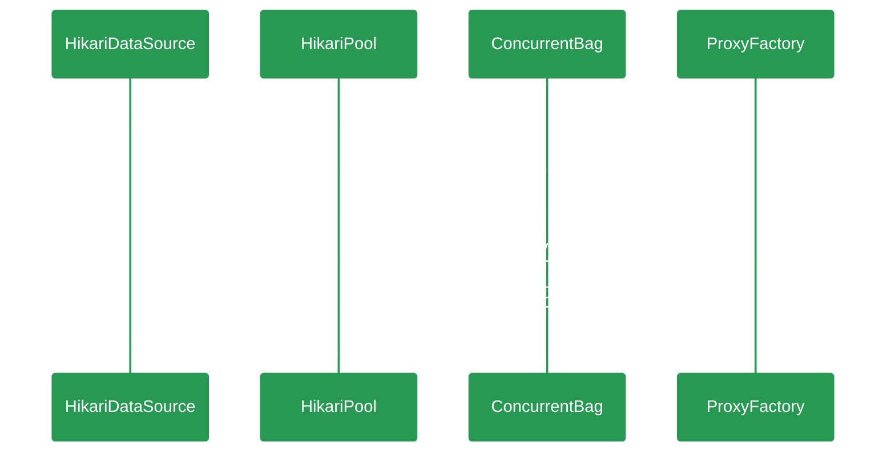

# {{ page.title }}

> Fast, simple, reliable. HikariCP is a "zero-overhead" production ready JDBC connection pool. At roughly 130Kb, the library is very light. 
> 一个简单、轻量（130kb）、稳定、高性能的JDBC数据库链接池，SpringBoot2.0开始作为Spring应用的默认数据库链接池。      

---
本文以开发者视角从代码层面分析及学习HikariCp的设计思路及技术应用，深入了解一下"光"背后的秘密。   




## HikariDataSource
``` java
public class HikariDataSource extends HikariConfig implements DataSource, Closeable {
  private final AtomicBoolean isShutdown = new AtomicBoolean(); // dataSource的状态，是否已关闭
  private final HikariPool fastPathPool; // final修饰的 HikariPool
  private volatile HikariPool pool; // volatile修饰的HikariPool 由于可见性及重排序的问题，相较于fastPathPool性能会低一些
  // 如果设置了dataSource参数lazy为true的情况，不会马上构建链接池，在getConnection的时候才会
  // 去初始化
  public HikariDataSource() {
      super();
      fastPathPool = null;
   }
   // 非lazy加载的情况下使用HikariConfig的配置创建数据源，并设置fastPathPool
   public HikariDataSource(HikariConfig configuration) {
      configuration.validate(); // 验证hikari的配置参数并设置默认值
      configuration.copyStateTo(this); // 使用入参配置项对当前类HikariConfig进行赋值
      pool = fastPathPool = new HikariPool(this); // 根据HikariConfig构建HikariPool
      this.seal(); // 封存 不再允许修改配置属性
   }

   @Override
   public Connection getConnection() throws SQLException {
      if (isClosed()) { // 判断数据源状态
         throw new SQLException("HikariDataSource " + this + " has been closed.");
      }
      if (fastPathPool != null) { return fastPathPool.getConnection();} // 优先使用fastPathPool获取Connection
      // 无参构造当前DataSource时候，涉及到并发获取链接，所以此处使用双重检查来初始化链接池并返回链接
      HikariPool result = pool;
      if (result == null) { synchronized (this) {
            result = pool;
            if (result == null) {
               validate();
               try { 
                  pool = result = new HikariPool(this);
                  this.seal();
               } catch (PoolInitializationException pie) {
               }
            }
         }
      }
      return result.getConnection();
   }
}
```

## HikariPool

## ConcurrentBag

## ProxyFactory

## 参考文档
+ [github/HikariCp](https://github.com/brettwooldridge/HikariCP)